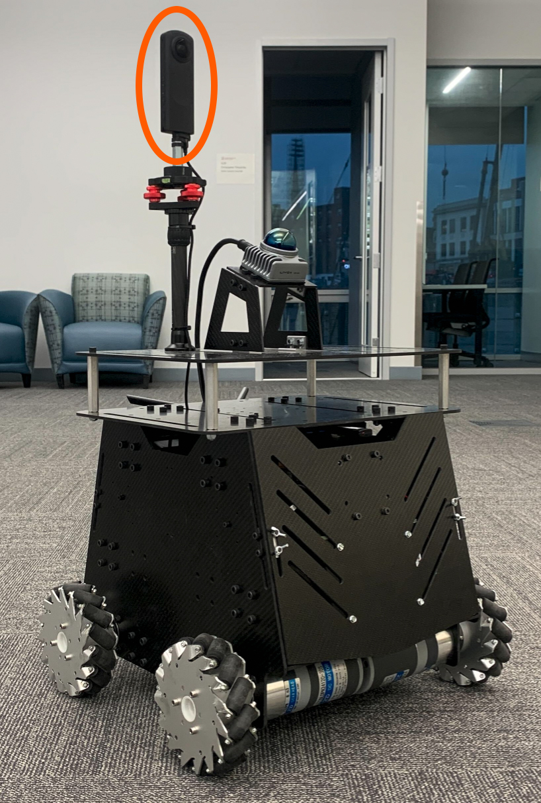

<p align="center">
  
</p>

The repository contains the 360 camera driver and manual lidar-to-camera extrinsic/latency calibration code to use a [Ricoh Theta Z1 camera](https://thetaz1.com/en/) with our [Mecanum wheel platform](https://github.com/jizhang-cmu/autonomy_stack_mecanum_wheel_platform). First, clone the repository and follow the readme in the 'src/receive_theta' folder to set up the 360 camera driver. Then, go to the '360_camera' ROS workspace folder in a terminal and compile.
```
  colcon build --symlink-install --cmake-args -DCMAKE_BUILD_TYPE=Release
```

Copy the 'start_360_camera.desktop' file in the 'desktop_button' folder to the desktop. Edit the 2 links to the '360_camera_sensorpod.sh' script and 'start.png' icon in the desktop file. Note that if using an add-on AI computer connected to the vehicle NUC computer via an Ethernet cable and the 360 camera plugged into the add-on AI computer, point the link to the '360_camera_ai_computer.sh' script instead. The script uses 'ROS_DOMAIN_ID=1' on the add-on AI computer and remaps the IMU topic to not use it in the 360 camera driver. Right-click the 'start_360_camera.desktop' file on the desktop and 'Allow Launching'. Double-click to launch the 360 camera driver.

To calibrate the lidar-to-camera extrinsics and latency, follow the readme in the 'src/extrinsic_latency_calib' folder.
