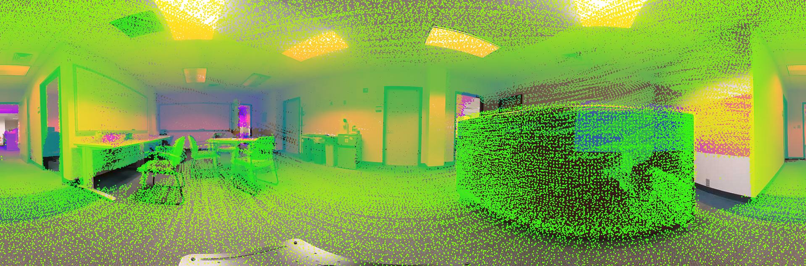
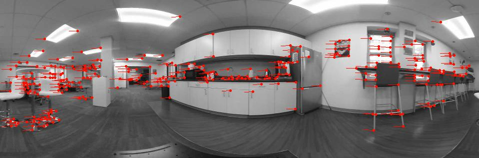
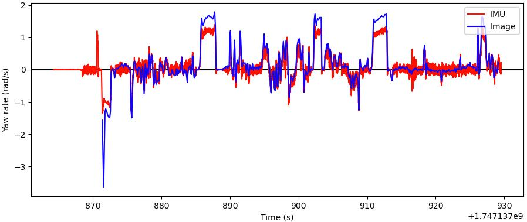

## Extrinsic Calibration

In the 'extrinsic_latency_calib/launch/extrinsic_calib.launch' file, set image resolution, 'imageWidth' and 'imageHeight'. Measure the camera offsets w.r.t. the lidar and set 'camX' (forward), 'camY' (left), and 'camZ' (up). If using a regular camera instead of a 360 camera, set 'is360Cam' to false, calibrate the camera intrinsics, and set image center, 'cx' and 'cy', focal length, 'fx' and 'fy', and distortion coefficients, 'k1', 'k2', 'p1', and 'p2'.

Start the autonomy system and the camera driver. Then, use the command line below to launch the extrinsic calibration node. Users should see an image with lidar point cloud projected onto it, as shown below. Click the image to bring it to the front. Press '1-6' on the keyboard to adjust the camera angle and align the image with the lidar point cloud. Update 'camRoll', 'camPitch', and 'camYaw' in the launch file accordingly.
```
  source install/setup.sh
  ros2 launch extrinsic_latency_calib extrinsic_calib.launch
```

<p align="center">
  
</p>

## Latency Calibration

Start the autonomy system and the camera driver. Then, use the command line below to launch the latency calibration node. Users should see an image with tracked features, as shown below. The node saves an 'imu.txt' file and an 'image.txt' file in the 'extrinsic_latency_calib/data' folder. The format is described in the 'readme.txt' file in the same folder. Now, use the joystick to rotate the vehicle back and forth 20-30 times.
```
  source install/setup.sh
  ros2 launch extrinsic_latency_calib latency_calib.launch
```

<p align="center">
  
</p>

In a terminal, go to the 'extrinsic_latency_calib/script' folder and run the command line below. Tune 'image_scale' in the Python script to bring the two curves to the same vertical magnitude. Then, tune 'image_latency' to match the curves horizontally. Zoom in to tune the latency finely. Finally, set 'imageLatency' in the 360 camera driver launch file, 'receive_theta/launch/receive_theta.launch'. Note that if 'imageLatency' has a non-zero value, add the tuned value from the Python script on top of the original value.
```
python3 latencyCalib.py
```

<p align="center">
  
</p>
